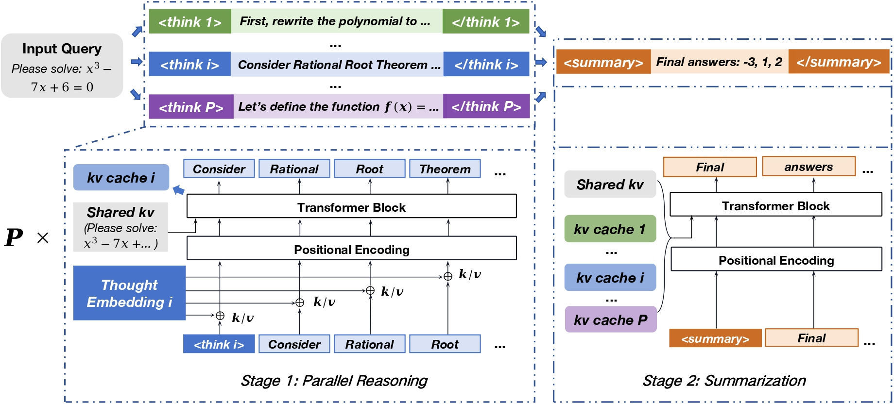

## ParaThinker — Native Parallel Thinking

[](https://arxiv.org/abs/2509.04475)

[](https://huggingface.co/Leslie04/ParaThinker-1.5B)



**This [vLLM](https://github.com/vllm-project/vllm) submodule contains a small, purpose-built customization that implements the *native parallel thinking* inference engine used by the ParaThinker project.**

- The implementation and design are described in our paper: **[“ParaThinker”](https://arxiv.org/pdf/2509.04475)**. It leverages the PagedAttention in vLLM for efficient memory management, mainly on reusing KV cache.
- See **Section 4.3 (Inference Engine)** in our paper for more details.
- ps: vLLM V1 is not supported for parallel thinking yet. Please set `os.environ["VLLM_USE_V1"] = "0"`.

[vLLM](https://github.com/vllm-project/vllm) is a fast and easy-to-use library for LLM inference and serving. Originally developed in the [Sky Computing Lab](https://sky.cs.berkeley.edu) at UC Berkeley, vLLM has evolved into a community-driven project with contributions from both academia and industry.

## Installation

**Good news:** the ParaThinker customization for the native parallel thinking inference engine only modifies Python code in vLLM. You can build this inference engine from source in editable mode. The following is a simplest script to build a conda environment for ParaThinker: *(Please see [vLLM build-from-source documentation](https://docs.vllm.ai/en/latest/getting_started/installation/gpu.html#build-wheel-from-source) to learn more)*

```bash
set -e 

eval "$(conda shell.bash hook)"
if ! conda env list | grep -q "parathinker"; then
    conda create -n parathinker python=3.11
fi

conda activate parathinker

cd ./inference
VLLM_USE_PRECOMPILED=1 pip install --editable .
```

> Follow the upstream vLLM build-from-source instructions if you later modify or add C/C++/CUDA/HIP extensions. For Python-only changes, the editable install above is sufficient.

## Quick Start

The usage of ParaThinker inference engine is basically identical to the vllm workflow. We have offered an example under `examples/parathinker/example.py`.

Based on the original vLLM API, we further additionally introduce the following parameters:

| Parameter           | Description                                                  | Default/Example              |
| ------------------- | ------------------------------------------------------------ | ---------------------------- |
| `cot_token_ids`     | Token IDs of Special Tokens for Boosting Thought Diversity, placed at the beginning of each reasoning path to lead the model to generate a distinct trajectory. (<think1> ~ <think8> here) | IDs of `<think1>`~`<think8>` |
| `okay_token_ids`    | Optional (different) forced token after different special tokens (cot_token_ids above). | `[[]] * 8` (empty list for each path)            |
| `summary_token_ids` | Token IDs of summary template under summarization stage. The template we use is `"<summary>By analyzing multiple reasoning processes above, I concluded that: The final answer is"`. | IDs for summary tempalte     |
| `parthink_size`     | Parallel Size / Number of parallel reasoning paths. (Currently only supports a maximum of 8) | 4                            |
| `pad_token_id`      | Padding token used for fill the block under PagedAttention mechanism | ID of `<vllm_pad>`           |

## Others

- **Contact Us:** For any technical questions and bug reports, please use GitHub [Issues](https://github.com/MobileLLM/ParaThinker/issues) or send an email📧 to 8208220105@csu.edu.cn

- **Related Links: **
  - ParaThinker paper (reference): https://arxiv.org/pdf/2509.04475
  - vLLM build-from-source documentation (follow this for authoritative install steps): https://docs.vllm.ai/en/latest/getting_started/installation/gpu.html#build-wheel-from-source
  - vLLM upstream: https://github.com/vllm-project/vllm